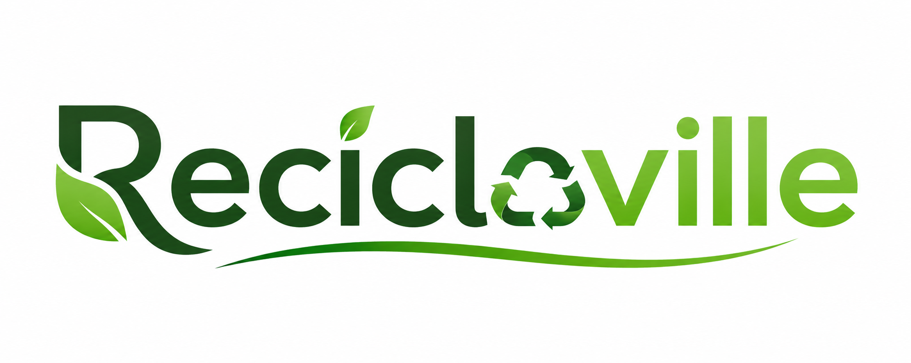

<p align="center">
  
</p>

[](https://www.oracle.com/br/java/technologies/downloads)
[](https://spring.io)
[](https://www.postgresql.org)
[](https://www.postman.com)
[](https://www.jetbrains.com/)
[](https://www.jetbrains.com/pt-br/idea/)
[](https://maven.apache.org/)

## Sobre

O Reciclaville, criado em 2025, é uma API desenvolvida com JDK 24.0.2 e Spring 3.4.5, utilizando PostgreSQL como banco de dados, que possibilita o registro de materiais recicláveis em pontos de coleta pelo país.

## Banco de dados

1. Crie um database chamado reciclaville
2. Em application.properties substitua "SUA_SENHA" pela senha do seu banco de dados
3. Inicialize a aplicação

## Execução

- Inicialize a aplicação com: `.\mvnw spring-boot:run`
- IDE utilizada IntelliJ IDEA 2025.2.1:
    https://www.jetbrains.com/pt-br/idea/download/?section=windows
- Para utilizar os endpoints da API use Postman ou Insomnia:
    https://www.postman.com/downloads/

- **Porta de acesso do Spring:**
    `http://localhost:8080`

### Endpoints

- GET /materiais - lista materiais
- GET /materiais/{id} - lista material pelo id
- POST /materiais - cadastra material
- PUT /materiais/{id} - atualiza material pelo id
- DELETE /materiais/{id} - deleta material pelo id

**Exemplo GET:**
`http://localhost:8080/materiais`

**Exemplo de resposta**
```json
{
  "id": 1,
  "nome": "PAPEL",
  "percCompensacaoMaterial": 10.0
}
```

- GET /clientes - lista clientes
- GET /clientes/{id} - lista cliente pelo id
- POST /clientes - cadastra cliente
- PUT /clientes/{id} - atualiza cliente pelo id
- DELETE /clientes/{id} - deleta cliente pelo id

**Exemplo PUT:**
`http://localhost:8080/clientes/1`
*deve ser selecionado o item "raw" no body para declarar o JSON*

**Exemplo de requisição**
```json
{
  "empresa": "EcoVille",
  "cnpj": "05.909.690/0001-10",
  "nicho": "VIDRO",
  "representante": "Rodrigo da Silva"
}
```
**Exemplo de resposta**
```json
[
  {
    "id": 1,
    "empresa": "EcoVille",
    "cnpj": "05.909.690/0001-10",
    "nicho": "VIDRO",
    "representante": "Rodrigo da Silva"
  }
]
```

- GET /declaracoes - lista declaracoes
- GET /declaracoes/{id} - lista declaracao pelo id
- POST /declaracoes - cadastra declaracao
- DELETE /declaracoes/{id} - deleta declaracao pelo id

**Exemplo POST:**
`http://localhost:8080/declaracoes`
*deve ser selecionado o item "raw" no body para declarar o JSON*

**Exemplo de requisição**
```json
{
  "cliente": {
    "id": 1
  },
  "dataInicial": "2026-08-07",
  "dataFinal": "2026-09-10",
  "itens": [
    {
      "material": {
        "id": 1
      },
      "peso": 12
    }
  ]
}
```
**Exemplo de resposta**
```json

{
    "id": 1,
    "cliente": {
      "id": 1,
      "empresa": "EcoVille",
      "cnpj": "05.909.690/0001-10",
      "nicho": "VIDRO",
      "representante": "Rodrigo da Silva"
    },
    "dataDeclaracao": "2026-08-07",
    "dataInicial": "2026-08-07",
    "dataFinal": "2026-09-10",
    "pesoTotal": 12.0,
    "percTotalCompensacao": 10.0,
    "itens": [
      {
        "id": 1,
        "idDeclaracao": 1,
        "material": {
          "id": 1,
          "nome": "PAPEL",
          "percCompensacaoMaterial": 10.0
        },
        "percCompensacao": 10.0,
        "peso": 12.0,
        "toneladasCompensadas": 1.2
      }
    ]
}
```

## Considerações finais

Projeto baseado no estilo REST e no padrão arquitetural MVC
